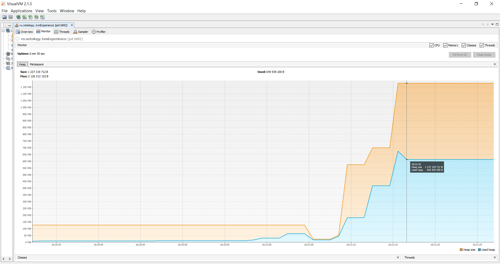

### Процесс работы программы:

```
16:20:27: Executing task 'JvmExperience.main()'...

> Task :compileJava UP-TO-DATE
> Task :processResources NO-SOURCE
> Task :classes UP-TO-DATE

> Task :JvmExperience.main()
Please open 'ru.netology.JvmExperience' in VisualVm

// загрузка классов из пакета io.vertx в metaspace
16:20:58.224426100: loading io.vertx

// было загружено 529 классов
16:20:58.632532100: loaded 529 classes
```

На графике Classes видно увеличение числа классов в связи с загрузкой новых классов:


На графике Heap видно небольшое увеличение Used heap:


На графике Metaspace видно появление и увеличение Metaspace size и Used metaspace в связи с загрузкой новых классов:


```
// загрузка классов из пакета io.netty в metaspace
16:21:01.639085500: loading io.netty

// было загружено 2117 классов
16:21:02.190700600: loaded 2117 classes
```

На графике Classes видно большое увеличение числа классов в связи с загрузкой новых классов:


На графике Heap видно увеличение Used heap, Heap size остаётся без изменений:


На графике Metaspace видно увеличение Metaspace size и Used metaspace в связи с загрузкой новых классов:


```
// загрузка классов из пакета org.springframework в metaspace
16:21:05.196308600: loading org.springframework

// было загружено 869 классов
16:21:05.423667: loaded 869 classes
```

На графике Classes видно увеличение числа классов в связи с загрузкой новых классов:


На графике Heap видно значительное уменьшение Used heap и Heap size в результате работы Garbage Collector:


На графике Metaspace видно увеличение Metaspace size и Used metaspace в связи с загрузкой новых классов:


```
16:21:08.435962400: now see heap

// создание 5 млн объектов
16:21:08.435962400: creating 5000000 objects

// было создано 5 млн объектов
16:21:08.826364500: created
```

Далее мы не подгружаем новые классы, по этому график Classes остаётся практически без изменений до конца работы программы:


На графике Heap видно резкое увеличение Used heap и Heap size после начала создания объектов:


Далее мы не подгружаем новые классы, по этому график Metaspace остаётся практически без изменений до конца работы программы:


```
// создание 5 млн объектов
16:21:11.841412800: creating 5000000 objects

// было создано 5 млн объектов
16:21:12.059957100: created
```

На графике Heap видно увеличение Used heap и Heap size после начала создания объектов:


```
// создание 5 млн объектов
16:21:15.135751600: creating 5000000 objects

// было создано 5 млн объектов
16:21:15.416938400: created
```

На графике Heap видно увеличение Used heap и сильное увеличение Heap size после начала создания объектов:


Далее на графике Heap видно уменьшение Used heap в результате работы Garbage Collector, после чего график в дальнейшем остаётся без изменений:

```
// завершение работы программы 
BUILD SUCCESSFUL in 51s
2 actionable tasks: 1 executed, 1 up-to-date
16:21:18: Task execution finished 'JvmExperience.main()'.
```
